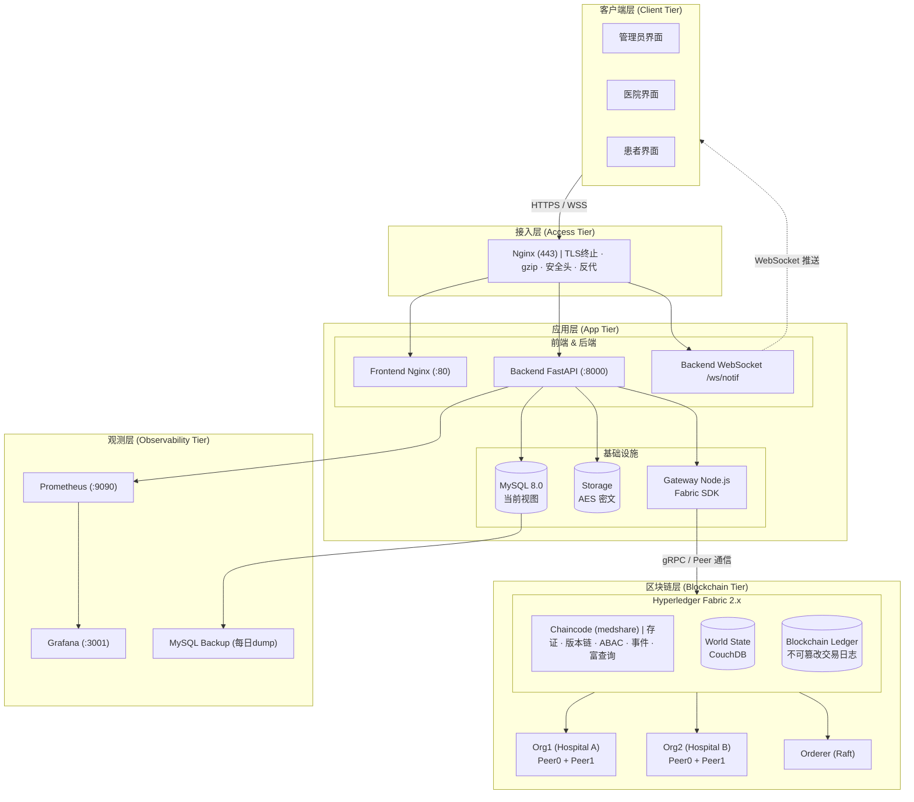
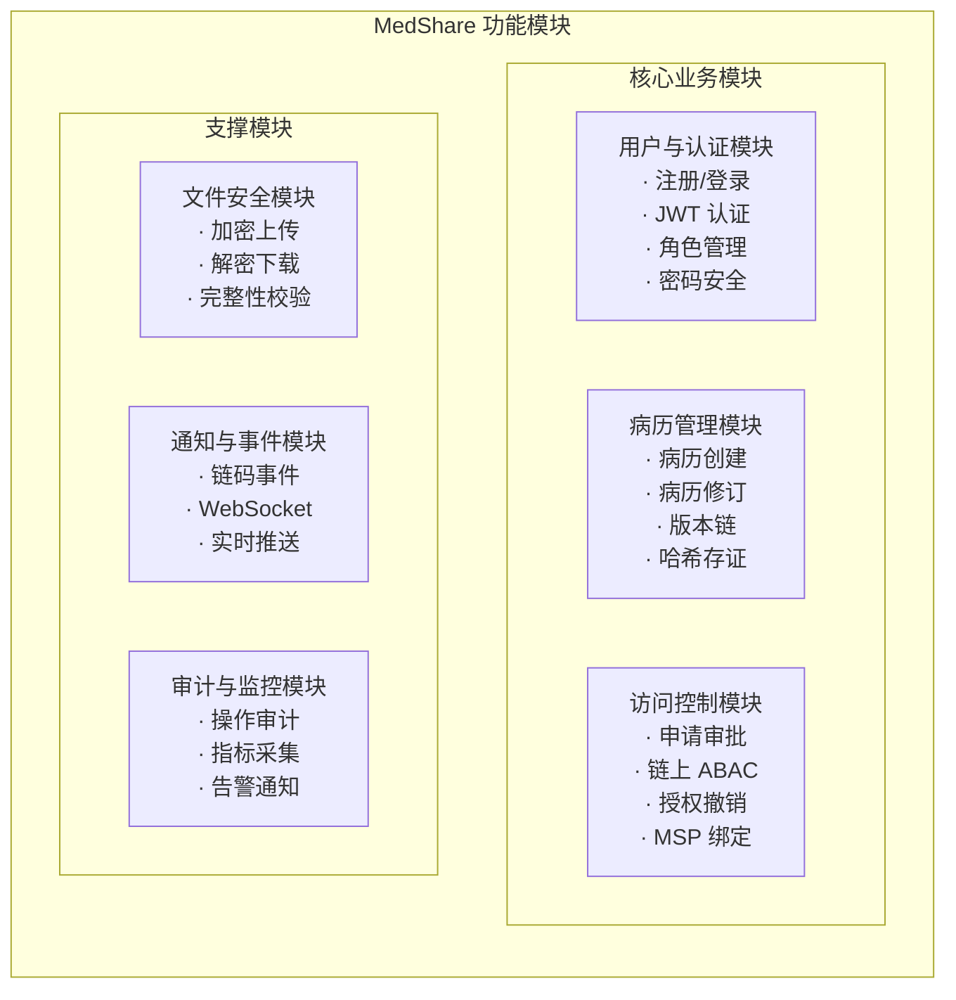
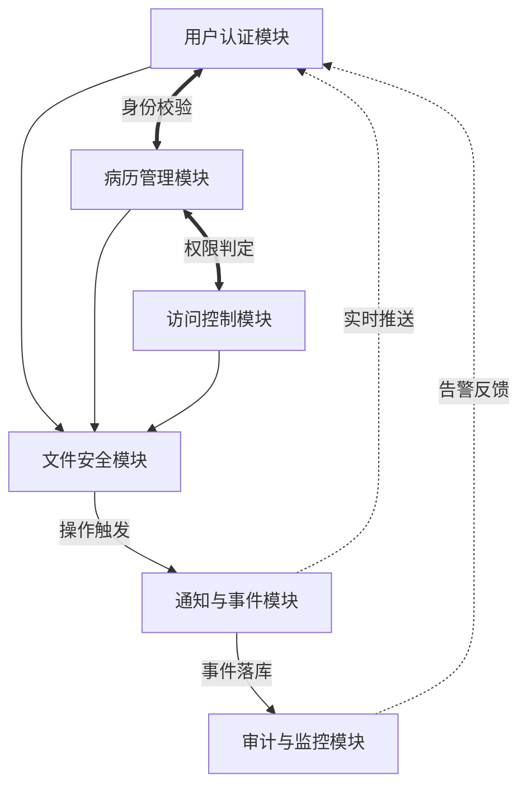
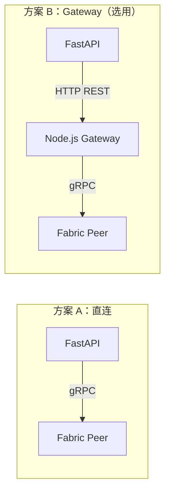
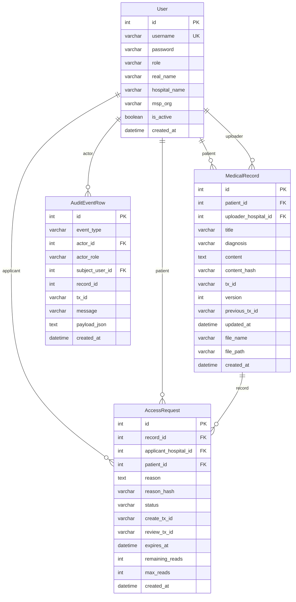
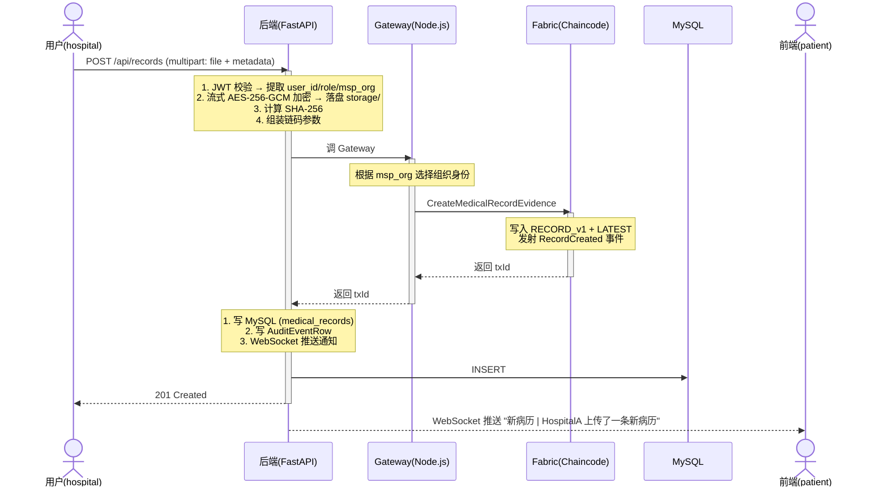
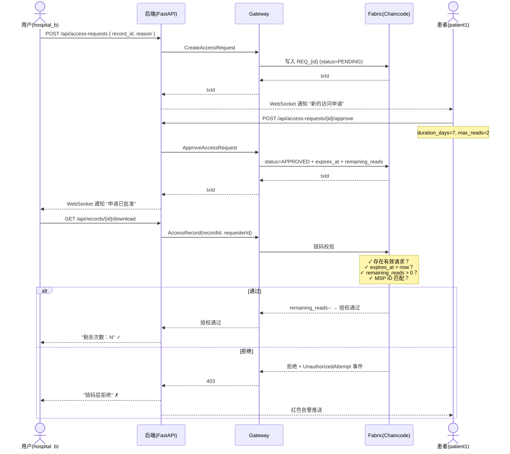
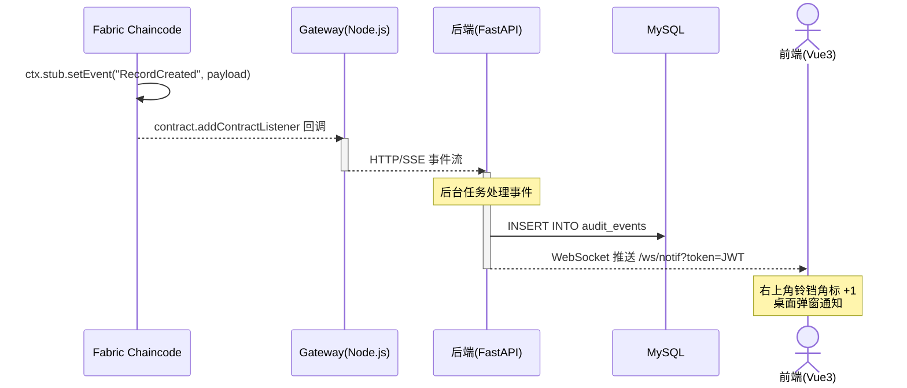
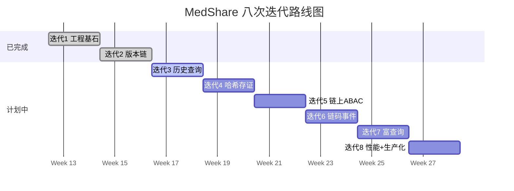

# MedShare 系统设计文档

> **版本**：第二周版本（v0.2）  
> **状态**：草案，后续持续迭代  
> **适用课程**：区块链技术课 · 7 周项目  
> **上次更新**：2026-04-27  

---

## 目录

1. [项目背景与目标概述](#1-项目背景与目标概述)
2. [系统总体架构](#2-系统总体架构)
3. [核心功能模块及其交互关系](#3-核心功能模块及其交互关系)
4. [技术栈初步选择及理由](#4-技术栈初步选择及理由)
5. [数据模型与数据库设计的初步思路](#5-数据模型与数据库设计的初步思路)
6. [关键接口与数据流的高层设计](#6-关键接口与数据流的高层设计)
7. [非功能性需求的初步考虑](#7-非功能性需求的初步考虑)
8. [风险评估与后续迭代计划](#8-风险评估与后续迭代计划)

---

## 1. 项目背景与目标概述

### 1.1 项目背景

在传统医疗体系中，患者病历数据通常由各医院独立存储。跨院数据共享面临三大核心难题：

| 难题 | 传统方案的局限 |
|------|---------------|
| **数据孤岛** | 医院 A 无法安全访问医院 B 的病历；患者转院需重复检查 |
| **信任缺失** | 集中式数据中心可能被单方篡改；患者无法确知"谁在何时看了我的病历" |
| **授权粗放** | 一旦授权则永久有效，缺乏精细化的时效、次数控制与即时撤销能力 |

**区块链技术**为此提供了天然的解决方案：联盟链的多方背书机制保证数据不可篡改，智能合约（链码）可执行精细化的访问控制策略，分布式账本提供完整的审计轨迹。

### 1.2 项目愿景

**MedShare** 是一个基于 **Hyperledger Fabric 2.x** 联盟链的医疗数据共享平台，面向教学与实验场景，实现"医院—患者—管理员"三方角色的病历上传、跨院访问、链上授权与全链路审计。

**核心设计原则（一句话概括）**：

> **MySQL 只保留当前视图，Fabric 保留唯一真相。**
>
> 文件在本地盘以密文存储；上链的只是哈希。访问控制策略（有效期 / 最大读取次数 / MSP 绑定 / 撤销）写进链码，即使绕过后端也无法绕过链码校验。

### 1.3 项目目标

| 维度 | 目标描述 |
|------|---------|
| **功能性** | 支持三角色（管理员 / 医院 / 患者）完成病历存证、修订追溯、跨院访问申请-审批-撤销、文件加密上传下载的完整业务闭环 |
| **区块链特性** | 版本链、链上历史查询（GetHistoryForKey）、哈希存证、链上 ABAC 访问控制、链码事件订阅、CouchDB 富查询 |
| **可靠性** | 链码测试覆盖率 ≥ 80%；后端测试覆盖率 ≥ 85%；关键路径（上传/审批/撤销）100% 经链码校验 |
| **可观测性** | Prometheus 指标采集 + Grafana 仪表板；全链路健康检查；结构化审计日志持久化 |
| **安全性** | bcrypt 密码哈希 + JWT 认证；AES-256-GCM 文件加密；HTTPS 传输；slowapi 限流；链上 MSP 身份绑定 |
| **教学价值** | 覆盖 Fabric 从"链码开发 → 交易设计 → 世界状态 → 历史溯源 → ABAC → 事件机制 → 富查询 → TPS 压测"的完整知识体系 |

### 1.4 项目范围边界

**本系统包含**：
- 用户注册/登录/角色管理（管理员、医院、患者）
- 病历创建与链上存证
- 病历版本链与修订追溯
- 跨院访问申请-审批-撤销闭环
- 文件加密存储与完整性校验
- 链码事件驱动的实时通知
- 审计日志与可观测性基础设施
- 性能压测与生产化部署方案

**本系统不包含**（明确排除）：
- 真实医疗数据标准（HL7/FHIR）适配（教学项目使用简化字段）
- 支付/计费模块
- 移动端 App
- 与真实医院 HIS 系统对接
- 生产级 CA 证书管理（实验环境使用自签证书）

---

## 2. 系统总体架构

### 2.1 概念级架构图



### 2.2 架构分层职责

| 层 | 组件 | 职责 |
|----|------|------|
| **客户端层** | Vue3 SPA | 按角色（admin/hospital/patient）提供差异化 UI；通过 HTTPS + JWT 与后端通信 |
| **接入层** | Nginx | TLS 终止、静态资源服务、反向代理、WebSocket upgrade、安全头注入 |
| **应用层** | FastAPI 后端 | 业务逻辑编排、用户认证、权限校验前置、文件加密、WebSocket 推送 |
| **应用层** | MySQL 8.0 | 存储"当前视图"数据：用户、病历当前版本元信息、审批请求缓存、审计事件 |
| **应用层** | Node.js Gateway | Fabric SDK 封装、链码调用路由、MSP 组织映射、历史查询缓存 |
| **应用层** | 本地存储 | AES-256-GCM 加密文件落盘，链上仅存 SHA-256 哈希 |
| **区块链层** | Fabric 2.x | 交易背书、区块打包、世界状态维护（CouchDB）、链码执行、事件发射 |
| **观测层** | Prometheus + Grafana | 指标采集、可视化仪表板、MySQL 自动备份 |

### 2.3 关键架构决策

| 决策 | 选择 | 理由 |
|------|------|------|
| **双存储模型** | MySQL（当前视图）+ Fabric（不可篡改历史） | MySQL 适合快速查询与关联；Fabric 提供不可篡改的审计轨迹 |
| **链上只存哈希** | 文件内容经 AES-256-GCM 加密后落盘；SHA-256 上链 | 保护隐私（链上无明文数据），降低链上存储压力 |
| **后端不直连 Fabric** | 通过独立的 Node.js Gateway 服务中转 | 隔离 Fabric SDK 的 Node.js 依赖，后端保持 Python 纯粹性 |
| **访问控制双保险** | 后端做快速校验 + 链码做最终裁决 | 即使后端被绕过，链码层仍可拒绝非法访问（ABAC 的"不可绕过"特性） |
| **MSP 组织映射** | 用户表 `msp_org` 字段 + Gateway 路由 | 医院 A → Org1MSP，医院 B → Org2MSP；Gateway 根据 msp_org 选择对应组织身份提交交易 |

---

## 3. 核心功能模块及其交互关系

### 3.1 功能模块总览



### 3.2 模块详细描述

#### 3.2.1 用户与认证模块

**目标**：提供三角色（admin / hospital / patient）的注册、登录与身份管理。

| 功能点 | 描述 | 计划迭代 |
|--------|------|----------|
| 用户注册 | 患者自助注册；管理员和医院由管理员创建 | 迭代 1 |
| 用户登录 | JWT 令牌签发；bcrypt 密码校验 | 迭代 1 |
| 密码修改 | 旧密码校验 + 新密码强度检查 | 迭代 1 |
| 角色绑定 | 每个用户绑定 `role`（admin/hospital/patient）与 `msp_org`（Org1MSP/Org2MSP） | 迭代 1 |
| 账号管理 | 管理员可启用/禁用账号；禁用后 JWT 即时失效 | 迭代 1 |
| 明文密码迁移 | 首次登录自动将老明文密码升级为 bcrypt 哈希 | 迭代 1 |

**与其他模块的关系**：
- 所有 API（除登录/注册）均需携带有效 JWT
- `msp_org` 字段被 Gateway 用于选择 Fabric 组织身份
- `role` 字段决定前端路由与接口权限

#### 3.2.2 病历管理模块

**目标**：支持医院上传病历、修订病历，并提供版本链追溯。

| 功能点 | 描述 | 计划迭代 |
|--------|------|----------|
| 病历创建 | 医院上传病历（标题、诊断、内容），计算哈希上链存证 | 迭代 1/4 |
| 病历修订 | 创建新版本，`previous_tx_id` 指向前版，形成版本链 | 迭代 2 |
| 版本链查询 | 沿 `previous_tx_id` 回溯全部历史版本 | 迭代 2 |
| 链上历史查询 | 调用 Fabric `GetHistoryForKey` 获取完整交易轨迹 | 迭代 3 |
| 文件上传 | 支持 PDF/JPG/PNG，AES-256-GCM 加密落盘 | 迭代 4 |
| 文件下载 | 解密 + 重算哈希与链上对比 → 完整性校验 | 迭代 4 |
| 富查询 | 按医院/时间段/患者条件查询（CouchDB Mango） | 迭代 7 |

**键设计（链码层）**：
```
RECORD_{id}_v{version}    —— 每版本完整内容独立存储
RECORD_LATEST_{id}        —— 最新版完整拷贝（热点索引，O(1) 读最新版）
```

#### 3.2.3 访问控制模块

**目标**：实现跨院病历访问的申请-审批-撤销闭环，并在链码层强制执行 ABAC 策略。

| 功能点 | 描述 | 计划迭代 |
|--------|------|----------|
| 访问申请 | 医院 B 发起对医院 A 病历的访问请求（附理由哈希） | 迭代 1 |
| 患者审批 | 患者审批/拒绝申请；审批时可设置有效期与最大读取次数 | 迭代 1/5 |
| 链上 ABAC | 过期检查、次数扣减、MSP 绑定校验均在链码内执行 | 迭代 5 |
| 授权撤销 | 患者可随时撤销已批准的授权 | 迭代 5 |
| 非法访问拦截 | 绕过后端直接调 Gateway 的非法请求被链码拒绝 | 迭代 5 |

**ABAC 策略矩阵**：

| 策略维度 | 校验位置 | 说明 |
|----------|---------|------|
| 过期时间 | 链码 `AccessRecord` | 基于 `ctx.stub.getTxTimestamp()` |
| 剩余次数 | 链码 `AccessRecord` | 每次访问 `remaining_reads--` |
| MSP 绑定 | 链码 `AccessRecord` | 校验调用方 MSP ID 匹配授权中的医院组织 |
| 撤销状态 | 链码 `AccessRecord` | 撤销后 `remaining_reads=0`，访问被拒 |
| 状态机 | 链码 `ApproveAccessRequest` / `RejectAccessRequest` | 仅 PENDING → APPROVED/REJECTED 合法 |

#### 3.2.4 文件安全模块

**目标**：实现"链上存证、链下存文件"的经典区块链存证范式。

| 功能点 | 描述 | 计划迭代 |
|--------|------|----------|
| 流式加密上传 | AES-256-GCM 加密 → 密文落盘 → SHA-256 上链 | 迭代 4 |
| 解密下载 | 读密文 → 解密 → 重算哈希 → 与链上对比 | 迭代 4 |
| 完整性校验 | 篡改密文或链上哈希 → 下载时 100% 检出 | 迭代 4 |
| 文件大小限制 | 单文件 ≤ 10MB | 迭代 4 |

#### 3.2.5 通知与事件模块

**目标**：打通"链上发生事件 → 链下即时响应"的实时推送通路。

| 功能点 | 描述 | 计划迭代 |
|--------|------|----------|
| 链码事件发射 | 关键操作调用 `ctx.stub.setEvent()` | 迭代 6 |
| Gateway 事件订阅 | `contract.addContractListener()` 监听事件 | 迭代 6 |
| WebSocket 推送 | 后端订阅 → WebSocket 推送到前端 | 迭代 6 |
| 前端通知铃铛 | 角标 + 桌面弹窗 + 通知中心列表 | 迭代 6 |

**事件类型**（初步定义）：
- `RecordCreated` — 新病历创建
- `RecordUpdated` — 病历修订
- `AccessApproved` — 访问申请被批准
- `AccessRevoked` — 授权被撤销
- `UnauthorizedAttempt` — 非法访问尝试（审计告警）

#### 3.2.6 审计与监控模块

**目标**：提供全链路可观测性，支撑安全审计与性能调优。

| 功能点 | 描述 | 计划迭代 |
|--------|------|----------|
| 审计事件持久化 | 链码事件写入 `audit_events` 表 | 迭代 6 |
| Prometheus 指标 | QPS / 延迟直方图 / WebSocket 连接数 / 审计事件数 | 迭代 8 |
| Grafana 仪表板 | "MedShare Overview" 预配面板 | 迭代 8 |
| 健康检查 | `/health`、`/health/live`、`/health/ready` | 迭代 8 |
| MySQL 备份 | 每日 `mysqldump` + 7 天轮转 | 迭代 8 |

### 3.3 模块交互关系图



**关键交互路径**：
1. **病历上传流**：用户认证 → 文件加密 → 哈希上链（病历管理 + 文件安全 + 区块链）
2. **跨院访问流**：用户认证 → 访问申请 → 链码 ABAC 校验 → 解密下载（访问控制 + 文件安全）
3. **实时通知流**：链上操作 → 链码事件 → WebSocket 推送 → 审计落库（通知事件 + 审计监控）

---

## 4. 技术栈初步选择及理由

### 4.1 技术栈全景

| 层次 | 技术选型 | 版本 | 选择理由 |
|------|---------|------|---------|
| **前端框架** | Vue 3 + Vite | 3.x / 5.x | 轻量、渐进式、与 Element Plus 生态契合；Vite 提供极快的 HMR |
| **UI 组件库** | Element Plus | 2.x | 成熟的中后台组件库，支持按角色差异化布局 |
| **后端框架** | FastAPI (Python) | 0.110+ | 异步高性能、自动 OpenAPI 文档、类型安全、Python 生态丰富 |
| **ORM** | SQLAlchemy 2.0 | 2.x | 成熟的 Python ORM，支持同步/异步、MySQL/SQLite 双模式 |
| **数据库** | MySQL 8.0 | 8.0 | 关系型数据存储（当前视图）；utf8mb4 字符集；成熟稳定 |
| **区块链平台** | Hyperledger Fabric | 2.x | 联盟链标杆，支持链码（智能合约）、私有数据、MSP 身份管理、CouchDB 富查询 |
| **链码语言** | JavaScript (Node.js) | 18 | 学习曲线低于 Go/Java；前后端语言统一降低认知负担 |
| **Fabric Gateway** | Node.js + fabric-network SDK | 2.2 | 简化 Fabric 交互；封装连接管理、组织切换、交易提交 |
| **文件加密** | AES-256-GCM (pycryptodome) | — | 认证加密模式，同时保证机密性与完整性；流式处理避免内存溢出 |
| **密码哈希** | bcrypt (passlib) | — | 抗彩虹表、内置盐值、计算成本可调 |
| **认证** | JWT (python-jose) | — | 无状态认证，适合前后端分离架构 |
| **实时推送** | WebSocket (FastAPI 原生) | — | 低延迟双向通信，原生支持，无需额外中间件 |
| **反向代理** | Nginx | 1.25+ | TLS 终止、gzip 压缩、安全头注入、WebSocket upgrade |
| **可观测性** | Prometheus + Grafana | 最新 | 行业标准监控栈；prometheus-fastapi-instrumentator 自动埋点 |
| **容器化** | Docker + Docker Compose | 最新 | 一键部署、环境一致性、多服务编排 |
| **性能压测** | Caliper + Locust | 0.5+ / 2.x | Caliper 专注链 TPS/延迟；Locust 覆盖 API 层并发 |
| **安全扫描** | bandit + npm audit + OWASP ZAP | — | Python/Node/Web 三层安全扫描 |

### 4.2 关键技术决策论证

#### 4.2.1 为什么选择 Hyperledger Fabric 而非以太坊？

| 维度 | Hyperledger Fabric | 以太坊 (Public) |
|------|-------------------|----------------|
| **网络类型** | 联盟链（许可制） | 公链（无许可） |
| **身份管理** | MSP（Membership Service Provider）证书体系 | 公私钥对，匿名 |
| **共识机制** | 可插拔（Raft/等） | PoW/PoS |
| **数据隐私** | 通道（Channel）+ 私有数据集合 | 全链公开 |
| **交易成本** | 无 Gas 费 | 需 Gas 费 |
| **吞吐量** | 数千 TPS（可配置出块参数） | 数十 TPS（L1） |
| **适合场景** | 企业间协作、医疗联盟 | 去中心化应用、DeFi |

医疗数据共享场景下，Fabric 的联盟链特性（许可制、MSP 身份、通道隔离）更贴合实际需求。

#### 4.2.2 为什么引入独立的 Gateway 服务？

```
方案 A（直连）：FastAPI ──gRPC──► Fabric Peer
方案 B（Gateway）：FastAPI ──HTTP──► Node.js Gateway ──gRPC──► Fabric Peer
```


选择方案 B 的理由：
1. Fabric Node.js SDK 是目前最成熟、文档最完善的 SDK
2. Python 的 Fabric SDK 生态较弱，维护不活跃
3. Gateway 服务可独立扩容、独立缓存、独立监控
4. 后端保持 Python 纯粹性，关注业务逻辑而非区块链细节

#### 4.2.3 为什么 MySQL + Fabric 双存储？

| 数据类别 | 存储位置 | 原因 |
|---------|---------|------|
| 用户信息 | MySQL | 需要关联查询、索引；与区块链无关 |
| 病历当前版本 | MySQL + Fabric | MySQL 用于快速列表查询；Fabric 用于不可篡改锚定 |
| 病历历史版本 | **仅 Fabric** | 体现"链上不可篡改历史"的核心价值 |
| 访问请求 | MySQL + Fabric | MySQL 缓存状态用于列表过滤；Fabric 保存完整审批轨迹 |
| 审计事件 | MySQL | 持久化便于查询但非链上数据源 |
| 加密文件 | 本地磁盘 | 链上仅存 SHA-256 哈希 |

---

## 5. 数据模型与数据库设计的初步思路

### 5.1 实体关系图（ER 图，概念级）



### 5.2 核心实体设计（MySQL）

#### User（用户表）

| 字段 | 类型 | 说明 |
|------|------|------|
| `id` | INT PK | 自增主键 |
| `username` | VARCHAR(64) UNIQUE | 登录名 |
| `password` | VARCHAR(128) | bcrypt 哈希 |
| `role` | VARCHAR(32) | admin / hospital / patient |
| `real_name` | VARCHAR(64) | 真实姓名 |
| `hospital_name` | VARCHAR(64) | 所属医院（仅 hospital 角色） |
| `msp_org` | VARCHAR(32) | MSP 组织标识（Org1MSP/Org2MSP） |
| `is_active` | BOOLEAN | 账号启用标记 |
| `created_at` | DATETIME | 创建时间 |

#### MedicalRecord（病历表）

| 字段 | 类型 | 说明 |
|------|------|------|
| `id` | INT PK | 自增主键 |
| `patient_id` | FK → User | 所属患者 |
| `uploader_hospital_id` | FK → User | 上传医院 |
| `title` | VARCHAR(255) | 病历标题 |
| `diagnosis` | VARCHAR(255) | 诊断 |
| `content` | TEXT | 病历内容 |
| `content_hash` | VARCHAR(64) | SHA-256 哈希（与链上一致） |
| `tx_id` | VARCHAR(128) | 链上交易 ID（当前版本） |
| `version` | INT | 当前版本号 |
| `previous_tx_id` | VARCHAR(128) | 上一版本 txId |
| `file_name` | VARCHAR(255) | 加密文件名 |
| `file_path` | VARCHAR(512) | 密文落盘路径 |
| `updated_at` | DATETIME | 最后修订时间 |
| `created_at` | DATETIME | 创建时间 |

#### AccessRequest（访问申请表）

| 字段 | 类型 | 说明 |
|------|------|------|
| `id` | INT PK | 自增主键 |
| `record_id` | FK → MedicalRecord | 目标病历 |
| `applicant_hospital_id` | FK → User | 申请医院 |
| `patient_id` | FK → User | 病历所属患者 |
| `reason` | TEXT | 申请理由 |
| `reason_hash` | VARCHAR(64) | 理由哈希（上链） |
| `status` | VARCHAR(32) | PENDING / APPROVED / REJECTED / REVOKED |
| `expires_at` | DATETIME | 授权过期时间 |
| `remaining_reads` | INT | 剩余读取次数 |
| `max_reads` | INT | 最大读取次数 |
| `created_at` | DATETIME | 创建时间 |

#### AuditEventRow（审计事件表）

| 字段 | 类型 | 说明 |
|------|------|------|
| `id` | INT PK | 自增主键 |
| `event_type` | VARCHAR(64) | 事件类型枚举 |
| `actor_id` | FK → User | 触发方 |
| `subject_user_id` | FK → User | 通知目标用户 |
| `record_id` | INT | 关联病历 |
| `tx_id` | VARCHAR(128) | 关联链上交易 |
| `message` | VARCHAR(512) | 事件描述 |
| `payload_json` | TEXT | 事件完整载荷 |
| `created_at` | DATETIME | 事件时间 |

### 5.3 链上数据结构（Fabric World State）

链码在 CouchDB 世界状态中维护以下键值结构：

**病历记录**（键：`RECORD_{id}_v{version}`）：
```json
{
  "docType": "RecordEvidence",
  "recordId": "1",
  "patientId": "patient1",
  "uploaderHospital": "HospitalA",
  "dataHash": "sha256...",
  "version": 2,
  "previousTxId": "abc123...",
  "createdAt": "2026-04-20T10:00:00Z",
  "updatedAt": "2026-04-21T14:30:00Z",
  "txId": "def456..."
}
```

**访问请求**（键：`REQ_{id}`）：
```json
{
  "docType": "AccessRequest",
  "requestId": "1",
  "recordId": "1",
  "applicantHospital": "HospitalB",
  "applicantOrg": "Org2MSP",
  "patientId": "patient1",
  "reasonHash": "sha256...",
  "status": "APPROVED",
  "expiresAt": "2026-05-04T10:00:00Z",
  "remainingReads": 3,
  "maxReads": 5,
  "createTxId": "abc123...",
  "reviewTxId": "def456..."
}
```

### 5.4 设计原则

1. **DB 只保留当前版本**：历史版本仅从链上查询。MySQL 中 `version` / `previous_tx_id` / `tx_id` 始终指向当前版本
2. **DB 不覆盖链上真相**：DB 中的 `status` / `remaining_reads` 等字段为缓存镜像，以链上状态为准
3. **CouchDB 索引优先**：高频查询字段（`uploaderHospital`、`patientId`、`createdAt`）预先创建索引
4. **字符集统一 utf8mb4**：MySQL 建库强制 `utf8mb4_unicode_ci`，避免中文乱码

---

## 6. 关键接口与数据流的高层设计

### 6.1 API 设计原则

- **RESTful 风格**：资源名词复数、HTTP 方法语义化、状态码标准
- **版本前缀**：`/api/` 作为统一前缀（当前不引入 `/v1/` 版本号，后续按需）
- **认证方式**：`Authorization: Bearer <JWT>` 头部
- **错误响应**：统一 `{"detail": "..."}`  格式
- **文档**：FastAPI 自动生成 OpenAPI（Swagger UI：`/docs`）

### 6.2 核心 API 端点（按模块）

#### 认证模块

| 方法 | 路径 | 描述 | 认证 |
|------|------|------|------|
| POST | `/api/auth/login` | 用户登录 | 无需 |
| POST | `/api/auth/register` | 患者注册 | 无需 |
| POST | `/api/auth/change-password` | 修改密码 | JWT |
| GET | `/api/auth/me` | 获取当前用户信息 | JWT |

#### 病历模块

| 方法 | 路径 | 描述 | 认证 | 角色 |
|------|------|------|------|------|
| POST | `/api/records` | 创建病历 | JWT | hospital |
| GET | `/api/records` | 病历列表（按角色过滤） | JWT | 全部 |
| GET | `/api/records/{id}` | 病历详情 | JWT | 全部 |
| POST | `/api/records/{id}/revise` | 修订病历 | JWT | hospital（上传者） |
| GET | `/api/records/{id}/history` | 链上版本历史 | JWT | 全部 |
| GET | `/api/records/{id}/version/{v}` | 查询指定版本 | JWT | 全部 |

#### 访问控制模块

| 方法 | 路径 | 描述 | 认证 | 角色 |
|------|------|------|------|------|
| POST | `/api/access-requests` | 发起访问申请 | JWT | hospital |
| GET | `/api/access-requests` | 申请列表（按角色过滤） | JWT | 全部 |
| POST | `/api/access-requests/{id}/approve` | 批准申请 | JWT | patient（病历所属者） |
| POST | `/api/access-requests/{id}/reject` | 拒绝申请 | JWT | patient |
| POST | `/api/access-requests/{id}/revoke` | 撤销授权 | JWT | patient |
| GET | `/api/access-requests/{id}/history` | 审批流历史 | JWT | 全部 |

#### 文件模块

| 方法 | 路径 | 描述 | 认证 | 角色 |
|------|------|------|------|------|
| GET | `/api/records/{id}/download` | 下载解密文件 | JWT | 有授权的 hospital/patient |
| GET | `/api/records/{id}/verify` | 校验文件完整性 | JWT | 全部 |

#### 审计与通知模块

| 方法 | 路径 | 描述 | 认证 | 角色 |
|------|------|------|------|------|
| GET | `/api/audit/events` | 审计事件列表 | JWT | admin |
| WS | `/ws/notif` | WebSocket 实时通知 | JWT（query 参数） | 全部 |

#### 监控模块

| 方法 | 路径 | 描述 | 认证 |
|------|------|------|------|
| GET | `/health` | 存活检查 | 无需 |
| GET | `/health/live` | Liveness 探针 | 无需 |
| GET | `/health/ready` | Readiness 探针（含 DB 检查） | 无需 |
| GET | `/metrics` | Prometheus 指标 | 无需 |

### 6.3 核心数据流

#### 6.3.1 病历创建流



#### 6.3.2 跨院访问流（含 ABAC 校验）



#### 6.3.3 实时通知流



### 6.4 服务间通信协议

| 链路 | 协议 | 说明 |
|------|------|------|
| 前端 ↔ Nginx | HTTPS (443) | TLS 终止，HTTP/1.1 + WebSocket |
| Nginx ↔ 后端 | HTTP/1.1 | 内网反代，WebSocket 带 Upgrade 头 |
| 后端 ↔ Gateway | HTTP/1.1 (REST) | JSON 请求/响应，内网通信 |
| Gateway ↔ Fabric Peer | gRPC | Fabric 原生协议；提交交易 + 查询 |
| 后端 ↔ MySQL | MySQL 协议 (3306) | SQLAlchemy ORM |
| Prometheus ↔ 后端 | HTTP `/metrics` | 每 15s 抓取 |

---

## 7. 非功能性需求的初步考虑

### 7.1 安全性

| 层面 | 措施 | 计划迭代 |
|------|------|----------|
| **传输安全** | Nginx HTTPS 强制（HTTP 301 → 443）；HSTS / X-Frame-Options / X-Content-Type-Options | 迭代 8 |
| **认证安全** | bcrypt 密码哈希 + 12 轮 cost；JWT 过期自动失效；`is_active` 禁用机制 | 迭代 1 |
| **限流防护** | slowapi 按 IP 限流：login 5/min、register 10/min | 迭代 8 |
| **文件安全** | AES-256-GCM 加密落盘 + SHA-256 上链双层完整性；主密钥走环境变量 | 迭代 4 |
| **授权安全** | 链上 ABAC（过期/次数/MSP 绑定/撤销）+ 后端 JWT 角色校验 | 迭代 5 |
| **审计追踪** | 所有上链操作 + 失败尝试均写入 `audit_events` | 迭代 6 |
| **安全扫描** | bandit（Python）+ npm audit（Node）+ OWASP ZAP（Web） | 迭代 8 |

### 7.2 性能

| 指标 | 初步目标 | 验证方式 |
|------|---------|---------|
| **链上查询 TPS** | ≥ 200（纯查询场景） | Caliper 基准测试（迭代 8） |
| **链上写入 TPS** | ≥ 30（受 Fabric 出块限制） | Caliper 基准测试（迭代 8） |
| **API 响应时间 P95** | < 500ms（100 并发） | Locust 压测（迭代 8） |
| **WebSocket 端到端延迟 P95** | < 2s（链上事件 → 前端通知） | 集成测试（迭代 6） |
| **历史查询缓存命中率** | ≥ 85%（30s TTL） | Gateway 缓存统计（迭代 3） |
| **文件加密吞吐** | ≥ 30MB/s（10MB 文件） | pytest 性能用例（迭代 4） |

### 7.3 可扩展性

| 维度 | 设计考虑 |
|------|---------|
| **水平扩展** | 后端和 Gateway 均为无状态服务，可多实例部署 + Nginx 负载均衡 |
| **数据库扩展** | MySQL 读多写少场景，可按需引入读写分离或缓存层（Redis） |
| **链码升级** | 利用 Fabric 链码生命周期管理（`peer lifecycle chaincode upgrade`），支持渐进式升级 |
| **索引扩展** | CouchDB 索引文件为声明式配置（`META-INF/statedb/couchdb/indexes/`），新增查询只需新增索引定义 |
| **组织扩展** | Fabric 通道支持动态添加组织（需完整 MSP 配置流程） |

### 7.4 可用性

| 措施 | 说明 |
|------|------|
| **健康检查** | `/health`（存活）/ `/health/ready`（就绪，含 DB `SELECT 1`） |
| **容器重启策略** | `restart: unless-stopped`；MySQL 带健康检查条件 |
| **MySQL 备份** | 每日 `mysqldump` + 7 天轮转 |
| **优雅关闭** | FastAPI `shutdown` 事件中关闭 WebSocket 连接；Gateway 正常断开 Fabric 连接 |
| **事件重连** | WebSocket 断线自动重连；Gateway 事件订阅支持 resume offset |

### 7.5 兼容性

| 维度 | 要求 |
|------|------|
| **浏览器** | Chrome / Firefox / Edge 最新两个大版本 |
| **Python** | 3.12 |
| **Node.js** | 18（Gateway）+ 20（链码测试） |
| **Docker** | Docker Desktop 4.x（含 Docker Compose v2） |
| **数据库** | MySQL 8.0，字符集 utf8mb4 |

---

## 8. 风险评估与后续迭代计划

### 8.1 风险矩阵

| 风险 | 影响 | 概率 | 等级 | 缓解措施 |
|------|------|------|------|---------|
| **Fabric 学习曲线陡峭** | 进度延迟 | 中 | **高** | 迭代 1 先搭建 mock 测试框架；后续迭代逐步引入真链交互 |
| **CouchDB 切换影响大** | 数据丢失/回滚困难 | 中 | **中** | 迭代 7 前保留 teardown 快照；索引文件提前准备并测试 |
| **链码升级流程复杂** | 迭代 2/3/5/6/7 均涉及升级 | 中 | **中** | 每次升级前备份当前链码包；熟悉 `peer lifecycle chaincode upgrade` 流程 |
| **Caliper 环境配置难** | 迭代 8 进度阻塞 | 低 | **中** | 提前准备简化版替代方案（并发 async 脚本调 Gateway） |
| **跨文件系统兼容问题** | Windows/WSL/Docker 环境问题 | 中 | **中** | 文档明确"Windows 开发 + WSL2 运行"模式；提供 PowerShell + bash 双套启动脚本 |
| **ABAC ClientIdentity 属性复杂** | 迭代 5 身份校验实现困难 | 低 | **低** | 可先用 MSP ID 做粗粒度校验作为 fallback |
| **并发冲突导致交易失败** | 同一病历并发修订被 peer 拒绝 | 低 | **低** | 前端加乐观锁提示；后端重试机制；链码版本号由链上计算防伪造 |
| **文件加密性能瓶颈** | 大文件上传下载慢 | 低 | **低** | 流式加密（pycryptodome 原生支持）；分块下载 + Range 头 |

### 8.2 八次迭代路线图



### 8.3 迭代维度递进逻辑

| 迭代 | 区块链核心概念 | 链码方法增量 | 后端接口增量 | 测试增量 |
|------|-------------|-------------|-------------|---------|
| 1 | MSP 身份映射、交易基础 | 6 个（CRUD + 基本审批） | 11 个（auth + records） | 31 条（16 + 15） |
| 2 | 版本链、`previous_tx_id` | +3（Update/GetLatest/GetVersion） | +2（revise/history） | +17（5 + 12） |
| 3 | `GetHistoryForKey`、链上溯源 | +2（GetRecordHistory/GetRequestHistory） | +1（history 增强） | +12 |
| 4 | 哈希存证、链下加密 | —（不增，数据字段增强） | +2（download/verify） | +12 |
| 5 | ABAC、MSP 绑定、链上撤销 | +2（AccessRecord/Revoke） | +2（revoke/access） | +15 |
| 6 | 链码事件、异步通知 | —（setEvent 嵌入现有方法） | +2（audit/ws） | +10 |
| 7 | CouchDB 富查询、索引 | +3（QueryByHospital/Date/Patient） | +3（chain query） | +8 |
| 8 | TPS/延迟测量、生产化 | —（性能优化） | +2（health/metrics） | +7 |

**累计总量（8 次迭代后）**：
- 链码方法：16 个
- 后端接口：25+ 个
- 链码测试（Mocha）：49 条
- 后端测试（pytest）：107 条

### 8.4 当前进度与下周计划（Week 2 → Week 3）

**本周（Week 2）已完成**：
- [x] 系统设计文档（本文档）
- [x] 病历版本链设计与实现（迭代 2）
- [x] 链码 `UpdateMedicalRecordEvidence` / `GetRecordLatest` / `GetRecordVersion`
- [x] 链码测试：20 条（+5 条版本链用例）
- [x] 后端测试：28 条（+12 条记录相关用例）
- [x] 后端 `/api/records/{id}/revise` 和 `/api/records/{id}/history` 接口
- [x] 前端版本 Tag 列 + 版本链抽屉

**下周（Week 3）预期**：
- [ ] 迭代 3：Fabric `GetHistoryForKey` 历史查询
- [ ] 链码新增 `GetRecordHistory` / `GetAccessRequestHistory`
- [ ] Gateway 增加 30s TTL 历史缓存
- [ ] 解决当前 history 接口 N+1 问题（一次取回全量）
- [ ] 前端病历详情页增加"链上时间线"组件
- [ ] 链码测试 +12 条、后端测试 +12 条

---

## 附录 A：术语表

| 术语 | 英文 | 说明 |
|------|------|------|
| 链码 | Chaincode | Hyperledger Fabric 中的智能合约，运行在 Peer 节点上 |
| 世界状态 | World State | Fabric 中当前键值对的快照，存储在 CouchDB 或 LevelDB 中 |
| MSP | Membership Service Provider | Fabric 的身份管理组件，基于 X.509 证书 |
| ABAC | Attribute-Based Access Control | 基于属性的访问控制，本项目中指在链码内执行的访问控制策略 |
| 富查询 | Rich Query | CouchDB 支持的条件查询（Mango query），相比 LevelDB 的键范围查询功能更强 |
| 版本链 | Version Chain | 通过 `previous_tx_id` 字段串联的版本序列 |
| Gateway | Fabric Gateway | 封装 Fabric SDK 的服务，隐藏区块链交互细节 |
| 链下存储 | Off-Chain Storage | 文件内容在本地磁盘加密存储，链上仅存哈希 |
| TPS | Transactions Per Second | 每秒交易处理量 |
| P95 | 95th Percentile | 95% 的请求在此值以下完成的延迟指标 |

## 附录 B：引用文档

| 文档 | 路径 | 说明 |
|------|------|------|
| 项目迭代计划 | `项目迭代计划（8次）.md` | 8 次迭代的顶层路线图 |
| FinalRead | `FinalRead.md` | 项目最终说明与部署指南 |
| README | `README.md` | 项目部署说明 |
| 迭代 1 报告 | `docs/iteration-01.md` | 工程基石 + 测试框架 |
| 迭代 2 报告 | `docs/iteration-02.md` | 病历版本链 + 修订追溯 |

---

> **文档状态**：第二周版本（v0.2），后续持续迭代  
> **下次更新预期**：第三周（迭代 3 完成后更新数据流与接口章节）  
> **审阅记录**：待导师审阅