# MedShare 系统完整演示方案

本方案按一次完整业务流来讲：医院上传病历，另一家医院申请访问，患者审批或撤销，管理员审计、锚定和治理。演示时不要只讲页面，要一直强调数据什么时候进 MySQL，什么时候进 Fabric，文件本体为什么不上链。

演示入口：

- 前端：http://localhost:5173
- 后端接口文档：http://localhost:8000/docs
- Gateway readiness：http://localhost:3000/ready

演示账号：

- 管理员：`admin / 123456`
- 医院 A：`hospital_a / 123456`，链上组织 `Org1MSP`
- 医院 B：`hospital_b / 123456`，链上组织 `Org2MSP`
- 患者：`patient1 / 123456`

截图都放在 `output/playwright/`，当前截图来自 2026-06-10 本机运行环境。

## 1. 系统一句话介绍

MedShare 是一个基于 Hyperledger Fabric 的医疗数据共享系统。前端负责医院、患者、管理员三类角色的操作；后端负责登录、数据库视图、文件加密、权限入口；Node Gateway 负责把后端请求转成 Fabric SDK 调用；Fabric 链码负责病历哈希存证、访问申请状态机、授权消费、撤销、冻结、Merkle 锚定和治理动作。

核心设计可以这样讲：

- MySQL 保存“当前业务视图”，方便页面列表查询。
- Fabric 保存“可信状态和历史”，包括病历哈希、访问申请、授权状态、读取次数、TxID。
- 文件本体不直接上链，只在后端加密落盘；链上保存 SHA-256 哈希，用来验证文件有没有被改。
- 权限不只写在后端，链码会再次校验状态、有效期、剩余次数和调用方 MSP。

## 2. 技术栈说明

系统分五层：

- 前端：Vue3 + Element Plus + Vite，按角色拆分页面。
- 后端：FastAPI + SQLAlchemy + JWT，提供业务 API、文件加密、审计事件、WebSocket 通知。
- 数据库：MySQL 8.0，保存用户、病历当前状态、访问申请镜像、审计事件、Merkle 批次。
- 区块链网关：Node.js + Fabric Gateway SDK，对接 Fabric 通道和链码。
- 区块链网络：Hyperledger Fabric 2.x test-network，两个组织 Org1/Org2，CouchDB 作为 state database，支持富查询。

关键链码能力：

- `CreateMedicalRecordEvidence`：病历哈希上链。
- `UpdateMedicalRecordEvidence`：病历版本链。
- `GetRecordHistory`：读取 Fabric 历史。
- `CreateAccessRequest` / `ApproveAccessRequest` / `RevokeAccessRequest` / `AccessRecord`：访问申请和授权消费状态机。
- `QueryRecordsByHospital` / `QueryPendingRequestsForPatient`：CouchDB 富查询。
- `AnchorRecordBatch` / `VerifyRecordInclusion`：Merkle Root 批量锚定和包含证明。
- `ProposeGovernanceAction` / `ApproveGovernanceAction` / `ExecuteGovernanceAction`：链上治理。

## 3. 完整数据流

### 3.1 登录数据流

用户在前端输入账号密码，后端校验后返回 JWT。前端把 JWT 存到 localStorage，后续所有 API 都带 `Authorization: Bearer <token>`。

这里还没有上链，因为登录是系统身份认证，不是医疗数据可信状态。

截图：

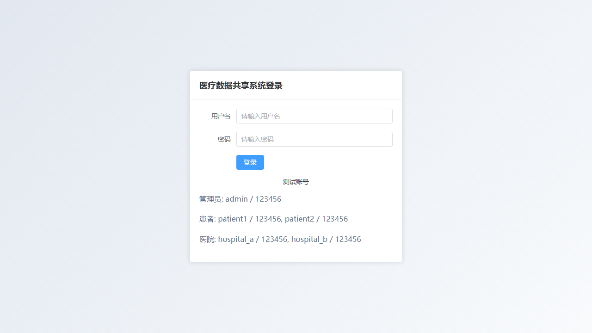

演示说明：

打开登录页，先说明三个角色都从同一个入口进入。不同角色登录后看到的菜单不同，这说明权限第一层在前端和后端角色控制；但真正关键的访问授权还会进入链码校验。

## 4. 医院 A：查看本院病历和链上哈希

登录 `hospital_a` 后进入“数据列表”。这里显示医院 A 上传或有权查看的病历。

截图：

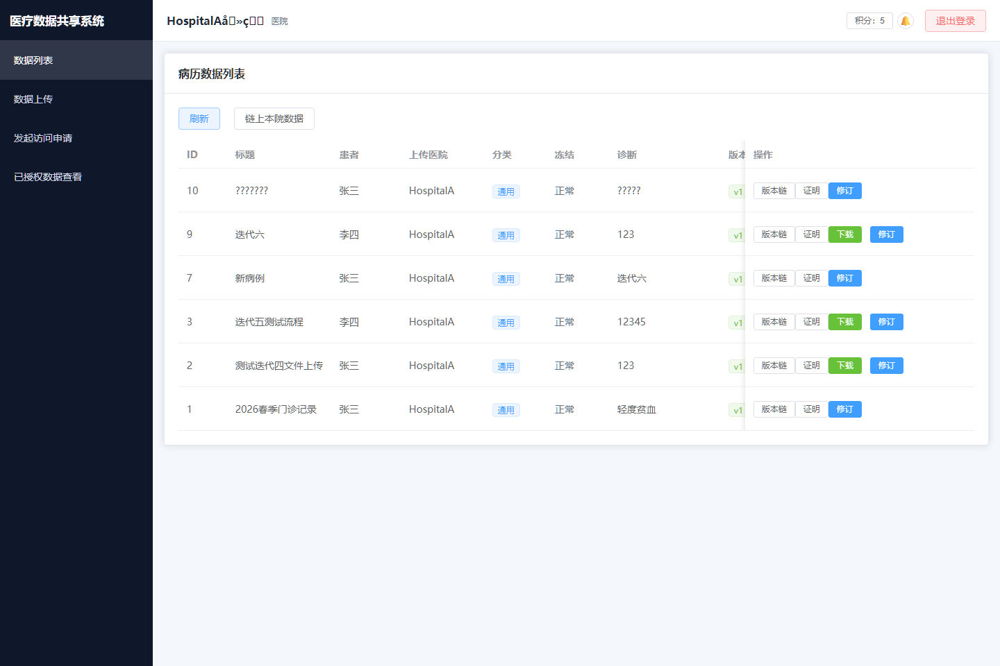

演示动作：

1. 登录 `hospital_a`。
2. 进入“数据列表”。
3. 指出每条病历里的 `TxID`、版本号、链上哈希标识。
4. 点击“链上本院数据”可以直接从 Fabric CouchDB 富查询读取本院最新版病历。

数据流：

- 页面请求 `/api/records`。
- 后端从 MySQL 读当前病历视图。
- 如果点击“链上本院数据”，后端请求 Gateway。
- Gateway 调链码 `QueryRecordsByHospital`。
- 链码通过 CouchDB selector 查询 `uploaderHospital=HospitalA` 且 `isLatest=true` 的病历证据。

区块链技术点：

这里体现的是“链上存证”和“富查询”。普通区块链适合追加写入，但 Fabric 使用 CouchDB 作为世界状态数据库后，可以按字段查询最新状态。页面中的 MySQL 列表用于业务展示，链上查询用于证明这些病历确实存在于 Fabric 世界状态中。

## 5. 医院 A：上传医疗数据

进入“数据上传”，医院可以上传文本病历或文件病历。

截图：

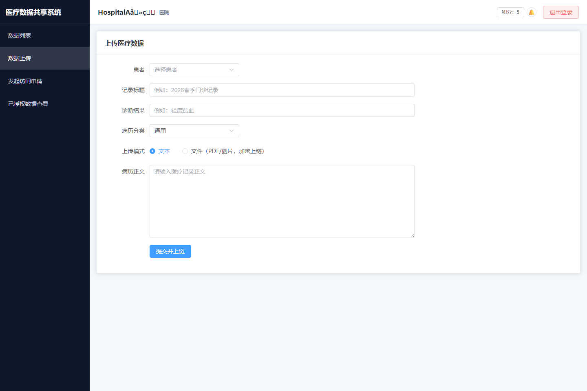

演示动作：

1. 进入“数据上传”。
2. 选择患者、填写标题、诊断、内容或选择文件。
3. 提交后观察成功提示里的 TxID。
4. 回到“数据列表”查看新记录。

数据流：

- 前端提交病历到 FastAPI。
- 如果是文本病历，后端计算内容 SHA-256。
- 如果是文件病历，后端先用 AES-256-GCM 加密文件并落盘，再计算文件哈希。
- 后端写 MySQL 当前视图。
- 后端调用 Gateway。
- Gateway 调链码 `CreateMedicalRecordEvidence`。
- 链码把 `recordId`、`patientId`、`uploaderHospital`、`dataHash`、`version`、`txId` 写入 Fabric。
- 链码发出 `RecordCreated` 事件。

区块链技术点：

文件不直接上链，因为医疗文件可能很大，而且涉及隐私。链上只保存哈希。这样既能证明文件未被篡改，又不会把敏感原文公开到链上。只要重新计算文件 SHA-256，与链上哈希一致，就能证明文件完整性。

## 6. 医院 B：发起跨院访问申请

切换登录 `hospital_b`，进入“发起访问申请”。医院 B 可以看到可申请的病历，但不能直接读取内容。

截图：

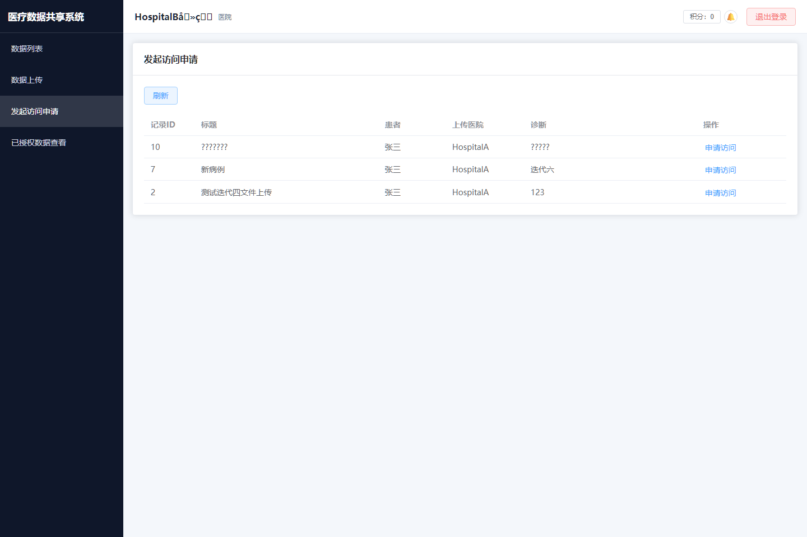

演示动作：

1. 退出医院 A，登录 `hospital_b`。
2. 进入“发起访问申请”。
3. 找到医院 A 上传的病历。
4. 点击“申请访问”，填写申请理由并提交。

数据流：

- 医院 B 在前端提交申请。
- 后端创建访问申请记录。
- Gateway 调链码 `CreateAccessRequest`。
- 链码写入 `AccessRequest`，状态为 `PENDING`。
- 链码记录申请方 MSP：医院 B 对应 `Org2MSP`。
- 链码记录归属患者 `patientId`。
- 系统写审计事件并通知患者。

区块链技术点：

这里不是简单地在数据库插一条申请。链码会把申请方组织 MSP 写进状态。后续真正读取病历时，链码会检查“当前调用方 MSP 是否等于当初申请时绑定的 MSP”。这能防止别的组织拿到 requestId 后冒用授权。

## 7. 患者：查看自己的医疗数据

登录 `patient1`，进入“我的医疗数据”。患者能看到自己名下的病历。

截图：

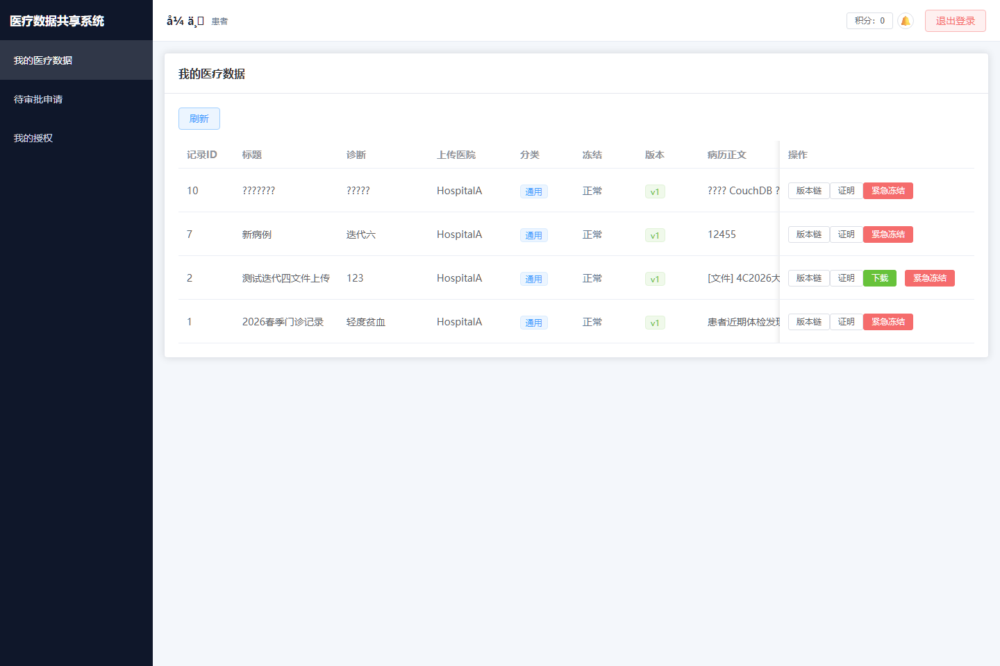

演示动作：

1. 登录 `patient1`。
2. 进入“我的医疗数据”。
3. 展示病历列表、链上哈希、版本、冻结状态。
4. 可以点击“链上时间线”查看 Fabric 历史。
5. 如需演示紧急控制，可以点击“紧急冻结”。

数据流：

- 页面请求患者自己的病历。
- 后端按 JWT 中的 user id 过滤。
- 查看链上时间线时，后端调用 Gateway。
- Gateway 调链码 `GetRecordHistory`。
- Fabric 返回该 key 的所有历史写入，包含每次变更 TxID。

区块链技术点：

Fabric 的 `GetHistoryForKey` 可以展示某个病历证据从创建到修订的完整历史。MySQL 只适合存当前字段，链上历史用于证明“什么时候由哪个交易改过”。

## 8. 患者：审批访问申请

患者进入“待审批申请”，审批医院 B 的访问请求。

截图：

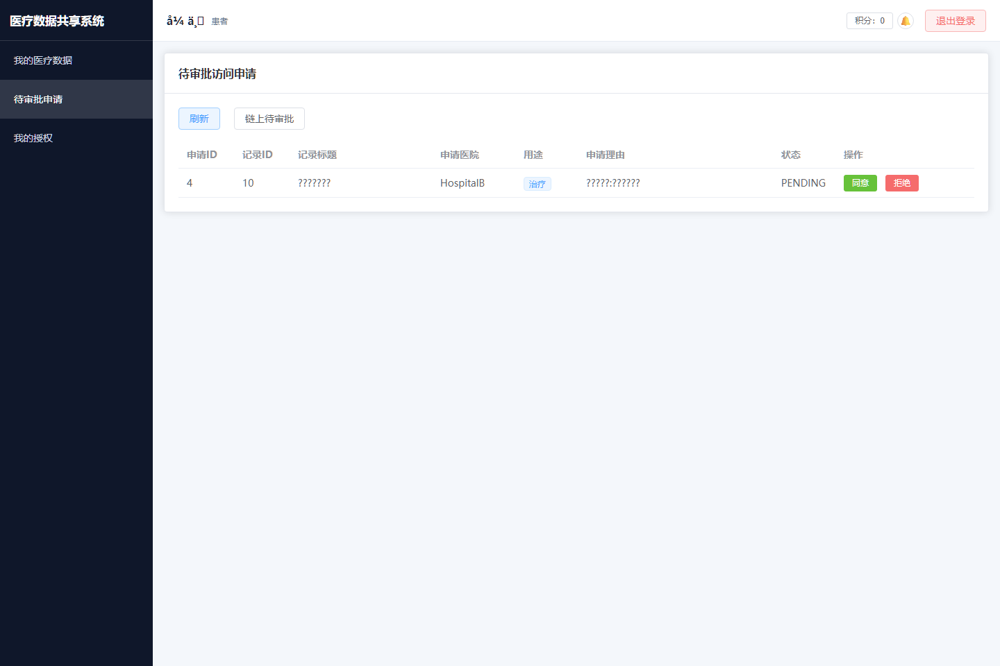

演示动作：

1. 进入“待审批申请”。
2. 查看医院 B 的申请。
3. 点击同意时填写有效天数和最大读取次数。
4. 也可以点击拒绝。
5. 点击“链上待审批”可以直接查询链上 PENDING 申请。

数据流：

- 患者审批时，后端确认当前用户就是病历归属患者。
- Gateway 调链码 `ApproveAccessRequest`。
- 链码检查状态只能从 `PENDING` 变成 `APPROVED` 或 `REJECTED`。
- 批准时写入 `expiresAtTs` 和 `remainingReads`。
- 后端同步 MySQL 镜像，并发出通知。

区块链技术点：

这是链上状态机。访问申请不能随意改状态，只能按链码允许的路径走：

`PENDING -> APPROVED -> REVOKED`

或：

`PENDING -> REJECTED`

审批通过时，有效期和最大读取次数也写进链码状态。后端就算被绕过，链码仍会拒绝过期或次数用尽的访问。

## 9. 患者：我的授权和撤销

进入“我的授权”，患者可以看到自己已经处理过的授权。

截图：

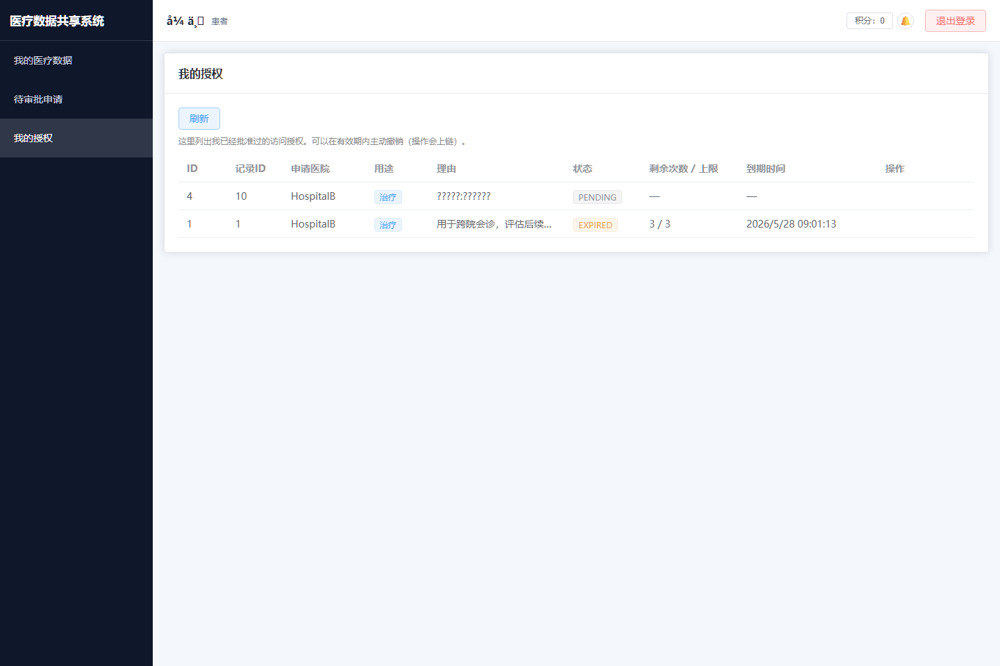

演示动作：

1. 进入“我的授权”。
2. 找到已批准的访问申请。
3. 点击“撤销授权”。
4. 再让医院 B 尝试访问，应该失败。

数据流：

- 患者撤销时，后端确认该申请属于当前患者。
- Gateway 调链码 `RevokeAccessRequest`。
- 链码检查当前状态必须是 `APPROVED`。
- 链码把状态改为 `REVOKED`。
- 后端把剩余读取次数置为 0，并写审计事件。

区块链技术点：

撤销不是只改数据库字段，而是链上状态变化。后续医院 B 即使还拿着 requestId，也会在链码 `AccessRecord` 里因为状态不是 `APPROVED` 被拒绝。

## 10. 医院 B：查看已授权数据并消费授权

医院 B 进入“已授权数据查看”，只能看到患者已经批准且仍有效的病历。

截图：

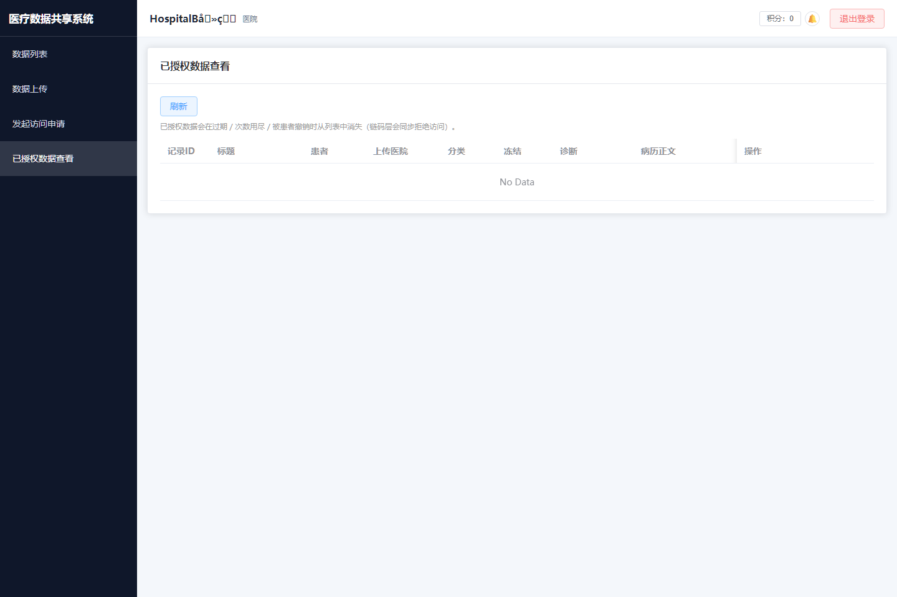

演示动作：

1. 登录 `hospital_b`。
2. 进入“已授权数据查看”。
3. 点击“下载（消费一次授权）”。
4. 观察提示里的剩余次数。
5. 多次下载直到次数用尽，系统会返回链码拒绝。

数据流：

- 医院 B 请求下载。
- 后端找到对应 `APPROVED` 申请。
- Gateway 调链码 `AccessRecord`。
- 链码检查五件事：
  - 申请存在。
  - 状态是 `APPROVED`。
  - 当前时间没有超过 `expiresAtTs`。
  - `remainingReads > 0`。
  - 当前调用方 MSP 等于申请时绑定的 MSP。
- 链码扣减 `remainingReads` 并写 `AccessRecorded` 事件。
- 后端再解密文件或返回文本内容。

区块链技术点：

这一步最能体现“访问控制写进链码”。医院不是只靠后端接口判断能不能下载，而是每次下载都要在链上消费一次授权。读取次数减少是链上状态变化，有 TxID，可审计。

## 11. 管理员：审计事件

管理员登录后进入“区块链审计与治理”。

截图：

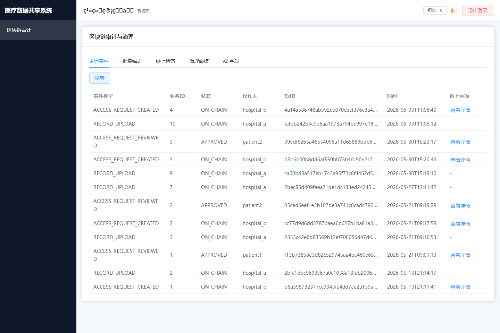

演示动作：

1. 登录 `admin`。
2. 进入“区块链审计”。
3. 展示病历上传、访问申请、审批、访问记录、非法访问等事件。
4. 对访问申请类事件点击“查看详情”，可以查链上状态。

数据流：

- 管理员页面读取后端审计接口。
- 审计事件来自业务操作后写入的 `audit_events`。
- 事件中的 TxID 可以对应 Fabric 交易。
- 对访问申请查看详情时，会走 Gateway 查询链上 `AccessRequest` 状态。

区块链技术点：

审计不是只看日志文本，而是把日志和链上交易关联。TxID 是 Fabric 交易的唯一标识，可以用来追溯该业务动作是否真的提交到链上。

## 12. 管理员：批量锚定和 Merkle Root

在管理员页点击“批量锚定”Tab。

截图：

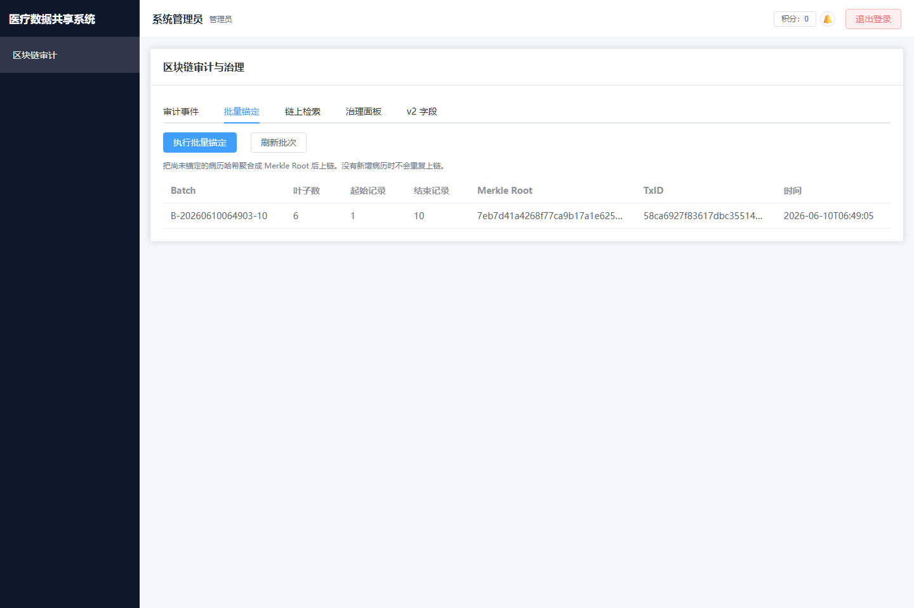

演示动作：

1. 点击“批量锚定”。
2. 点击“执行批量锚定”。
3. 查看批次列表：`batch_id`、`leaf_count`、`merkle_root`、`tx_id`。
4. 如果没有新增病历，重复点击会提示无未锚定病历。

数据流：

- 后端找出 MySQL 中未锚定的最新版病历。
- 对每条病历生成叶子哈希。
- 后端在链下计算 Merkle Root。
- Gateway 调链码 `AnchorRecordBatch`。
- 链码只保存 `batchId`、`merkleRoot`、`leafCount`、`txId`。
- 每条病历在 MySQL 中记录自己属于哪个 batch 和叶子下标。

区块链技术点：

Merkle Tree 适合批量存证。系统不用把每条病历都单独作为一个重交易证明，而是把一批病历哈希聚合成一个 Merkle Root 上链。后续只要提供某条病历的 leaf hash 和 proof，就能证明它属于该批次。

讲法：

“链上保存的是根，不保存全部叶子。这样交易更小，验证仍然可靠。”

## 13. 管理员：链上检索

在管理员页点击“链上检索”Tab。

截图：

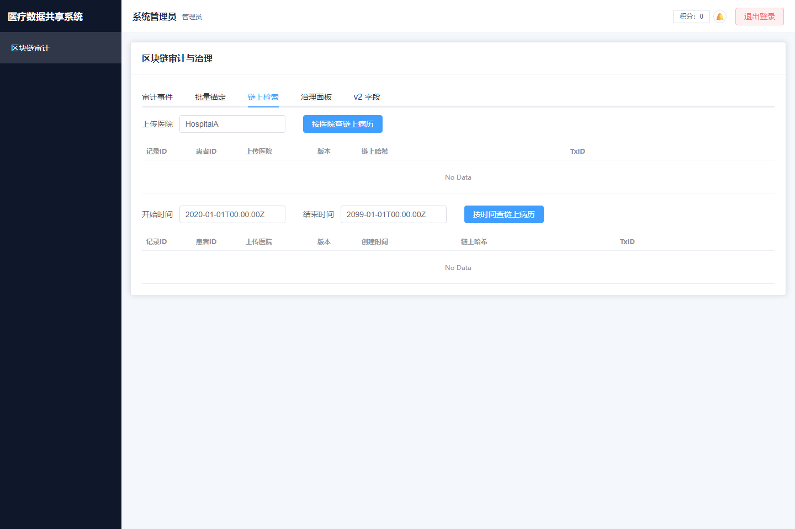

演示动作：

1. 点击“链上检索”。
2. 输入 `HospitalA`，点击“按医院查链上病历”。
3. 展示链上返回的病历 ID、患者 ID、版本、哈希、TxID。
4. 也可以按时间范围查询。

数据流：

- 前端调用 `/api/records/chain/by-hospital` 或 `/api/records/chain/by-date`。
- 后端调用 Gateway。
- Gateway 调 Fabric 链码富查询。
- 链码用 CouchDB selector 查询世界状态。

区块链技术点：

Fabric 和公链不一样，它适合联盟链业务系统。Fabric 的世界状态可以放在 CouchDB 中，链码可以做带条件的富查询。这里演示的是“从链上状态直接查”，不是从 MySQL 查。

注意：

如果按时间查询报 `no_usable_index`，说明 CouchDB 索引没有被 peer 正确加载。演示时优先用按医院查询，这条当前更稳定。

## 14. 管理员：治理面板和冻结/解冻

在管理员页点击“治理面板”Tab。

截图：

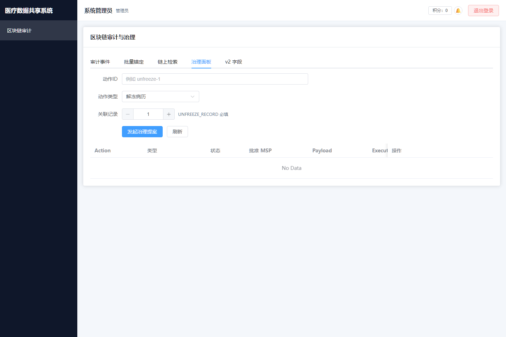

演示动作：

1. 点击“治理面板”。
2. 创建一个治理动作，例如 `UNFREEZE_RECORD`。
3. 填写关联病历 ID。
4. 发起提案、批准、执行。
5. 如果患者之前冻结过病历，管理员可用已执行的治理动作解冻。

数据流：

- 管理员发起治理动作。
- Gateway 调链码 `ProposeGovernanceAction`。
- 链码保存 `GovernanceAction`，状态为 `PROPOSED`。
- 批准时链码记录批准方 MSP。
- 满足两个不同 MSP 批准后，状态变为 `APPROVED`。
- 执行后状态变为 `EXECUTED`。
- 解冻病历时，链码校验治理动作必须已经执行，且 payload 中的 `recordId` 匹配。

区块链技术点：

这是链上治理。高风险动作不应该由单个后端接口直接完成，而是先在链上形成治理提案，再经过组织背书式批准，最后执行。

## 15. 共享积分

系统右上角有“积分”入口，不同角色都能查看链上积分账户。

截图：

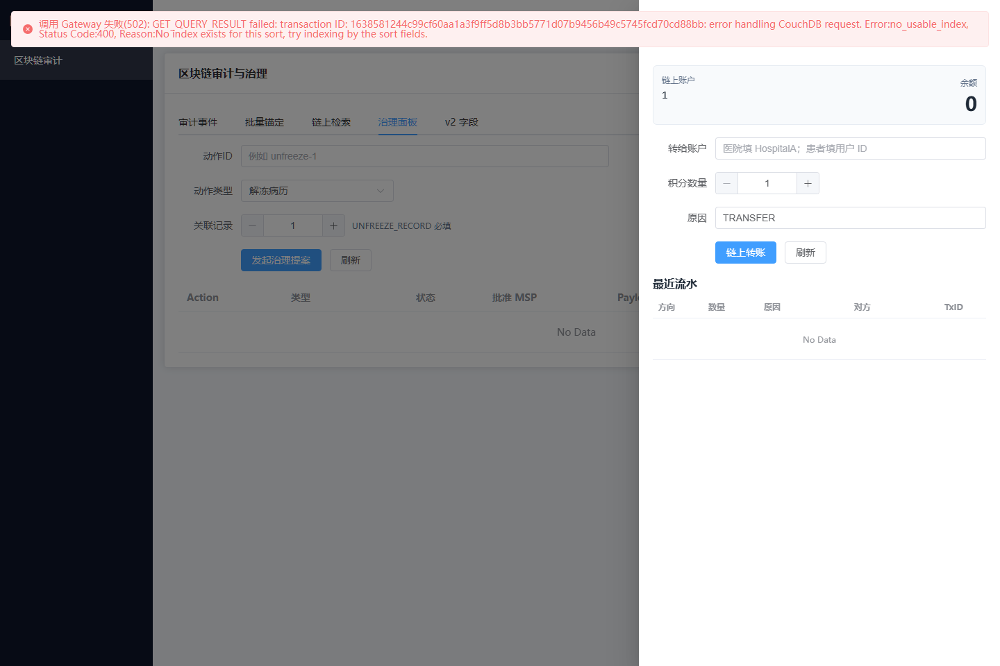

演示动作：

1. 点击右上角“积分”。
2. 查看余额和流水。
3. 可以演示链上转账。

数据流：

- 医院上传病历时，链码自动给上传医院加积分。
- 患者批准访问申请时，链码给患者加积分。
- 授权病历被访问时，链码给上传医院加积分。
- 转账调用链码 `CreditTransfer`。

区块链技术点：

积分不是后端随便加的数字，而是链码状态。它和数据共享行为绑定，能体现“贡献可计量、流转可追溯”。

## 16. 现场演示推荐顺序

建议按这个顺序走，比较顺：

1. 登录页：说明三类角色。
2. 医院 A 数据列表：说明病历哈希和 TxID。
3. 医院 A 上传：说明文件不上链，只上链哈希。
4. 医院 B 发起访问申请：说明跨院访问必须申请。
5. 患者待审批：说明患者掌握授权权利。
6. 患者我的授权：说明授权可撤销。
7. 医院 B 已授权数据：说明下载会消费链上次数。
8. 管理员审计：说明每个关键动作都有审计和 TxID。
9. 管理员批量锚定：说明 Merkle Root 批量存证。
10. 管理员链上检索：说明 Fabric + CouchDB 富查询。
11. 管理员治理面板：说明高风险操作走链上治理。

## 17. 可以直接照读的总结

这个系统不是简单的“医疗管理后台加一个区块链标签”。它把三类东西分开处理：

第一，病历原文和文件属于隐私数据，只在后端加密保存，不直接上链。

第二，病历哈希、版本、访问申请、授权次数、撤销和冻结属于可信状态，写入 Fabric 链码，由链码强制校验。

第三，MySQL 保存当前业务视图，前端展示更快；但关键状态都能通过 TxID、链上历史和 CouchDB 富查询回到 Fabric 验证。

所以演示重点是：医院不能绕过患者授权，患者可以审批和撤销，管理员可以审计和治理，所有关键动作都有链上交易作为证据。

## 18. 演示前检查命令

演示前建议跑：

```powershell
docker compose ps
curl.exe -s http://127.0.0.1:3000/ready
curl.exe -s http://127.0.0.1:8000/health
curl.exe -I -s http://127.0.0.1:5173/
```

期望结果：

- `medshare-gateway` 是 healthy。
- `medshare-mysql` 是 healthy。
- `medshare-backend` 和 `medshare-frontend` 是 Up。
- Gateway `/ready` 返回 Org1 和 Org2 都 ready。
- 后端 `/health` 返回 `{"status":"ok"}`。
- 前端首页返回 HTTP 200。

如果再次遇到 `gateway failed to start`，先看两个 CCAAS 链码容器是否还在：

```powershell
docker ps --filter "name=peer0org" --format "table {{.Names}}\t{{.Status}}"
```

如果 `peer0org1_medshare_ccaas` / `peer0org2_medshare_ccaas` 不在，按 `docs/dev-log.md` 里 2026-06-10 的两条 `docker run` 补启动，通常不需要重建 Fabric 网络。
